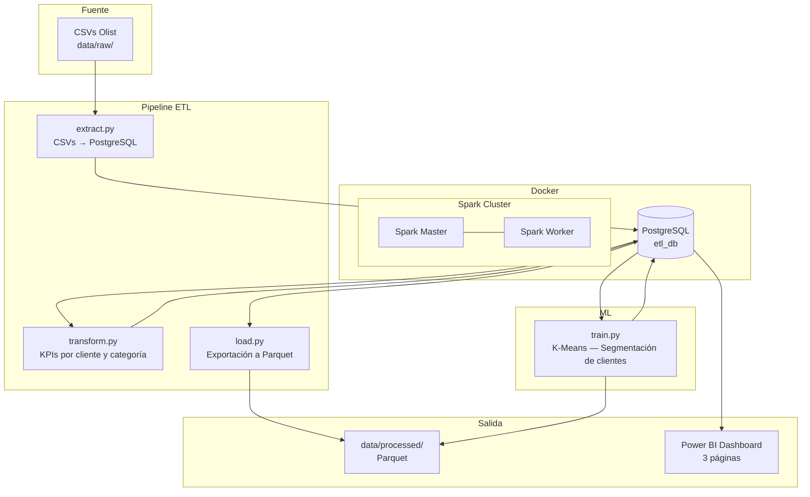

# ETL + ML Pipeline con PySpark y Power BI

Proyecto personal de ingeniería de datos que implementa un pipeline ETL completo sobre el dataset público de e-commerce **Olist**, combinando procesamiento distribuido con PySpark, segmentación de clientes con Machine Learning y visualización en Power BI.

---

## Arquitectura



---

## Stack tecnológico

| Capa | Tecnología |
|------|------------|
| Procesamiento | PySpark 3.4 |
| Machine Learning | PySpark MLlib — K-Means |
| Base de datos | PostgreSQL 15 |
| Contenedores | Docker + Docker Compose |
| Formato de salida | Apache Parquet |
| Visualización | Power BI Desktop |
| Control de versiones | Git + GitHub |

---

## Dataset

[Brazilian E-Commerce Public Dataset by Olist](https://www.kaggle.com/datasets/olistbr/brazilian-ecommerce) — dataset público disponible en Kaggle.

6 tablas relacionadas con ~100.000 pedidos reales de e-commerce en Brasil (2016–2018):

| Tabla | Descripción |
|-------|-------------|
| `orders` | Pedidos y sus fechas/estados |
| `customers` | Clientes (ciudad, estado) |
| `products` | Catálogo de productos |
| `order_items` | Líneas de cada pedido |
| `order_payments` | Método y valor del pago |
| `order_reviews` | Puntuación y fecha de review |

---

## Estructura del repositorio

```
project-etl-spark/
│
├── docker/
│   ├── docker-compose.yml       # PostgreSQL + Spark master + worker
│   ├── spark/Dockerfile         # Imagen Spark con driver JDBC y dependencias
│   └── postgres/init.sql        # Schema olist con 6 tablas
│
├── etl/
│   ├── extract.py               # CSVs → PostgreSQL
│   ├── transform.py             # KPIs de cliente y categoría
│   └── load.py                  # PostgreSQL → Parquet
│
├── ml/
│   └── train.py                 # Segmentación K-Means con MLlib
│
├── data/
│   ├── raw/                     # CSVs originales (no incluidos en el repo)
│   └── processed/               # Parquet generados por el pipeline
│
├── notebooks/                   # Análisis exploratorio (próximamente)
├── dashboard_olist.pbix         # Dashboard Power BI
└── README.md
```

---

## Cómo ejecutar el proyecto

### 1. Prerrequisitos

- Docker Desktop instalado y en marcha
- Dataset Olist descargado en `data/raw/` (ver enlace en sección Dataset)

### 2. Levantar la infraestructura

```bash
cd docker
docker compose up -d
```

Levanta 3 contenedores: PostgreSQL, Spark master y Spark worker.
Verifica el cluster en [http://localhost:8080](http://localhost:8080)

### 3. Ejecutar el pipeline ETL

```bash
# Cargar CSVs en PostgreSQL
docker exec -it spark_master /opt/spark/bin/spark-submit /app/etl/extract.py

# Calcular KPIs
docker exec -it spark_master /opt/spark/bin/spark-submit /app/etl/transform.py

# Exportar a Parquet
docker exec -it spark_master /opt/spark/bin/spark-submit /app/etl/load.py
```

### 4. Ejecutar el modelo ML

```bash
docker exec -it spark_master /opt/spark/bin/spark-submit /app/ml/train.py
```

### 5. Dashboard

Abre `dashboard_olist.pbix` en Power BI Desktop y refresca los datos conectando a:
- Host: `localhost` · Puerto: `5432`
- Base de datos: `etl_db` · Usuario: `etl_user` · Contraseña: `etl_pass`

---

## KPIs calculados

**Por cliente (`customer_kpis`)**
- Revenue total, número de pedidos, ticket medio, fecha del último pedido

**Por categoría (`category_kpis`)**
- Revenue total, número de pedidos, precio medio, puntuación media de reviews, % entregas a tiempo

---

## Resultados ML — Segmentación de clientes

Modelo K-Means (k=4) entrenado sobre `total_revenue`, `total_orders` y `avg_ticket`.
**Silhouette score: 0.939**

| Segmento | Clientes | % | Perfil |
|----------|----------|---|--------|
| 0 — Compradores únicos | 89.561 | 93,7% | 1 pedido · ticket ~130€ |
| 1 — Ocasionales | 2.773 | 2,9% | ~2 pedidos · ticket ~137€ |
| 2 — Alto valor | 3.204 | 3,4% | 1 pedido · ticket ~1.037€ |
| 3 — Outlier VIP | 1 | <0,1% | 16 pedidos · ticket ~56€ |

---

## Dashboard Power BI

3 páginas:

- **Segmentación de clientes** — distribución por segmento, revenue y ticket medio por grupo
- **Rendimiento por categoría** — top categorías por revenue, precio vs valoración, % entregas a tiempo
- **Valor por cliente** — revenue por estado, mapa geográfico, KPIs globales
